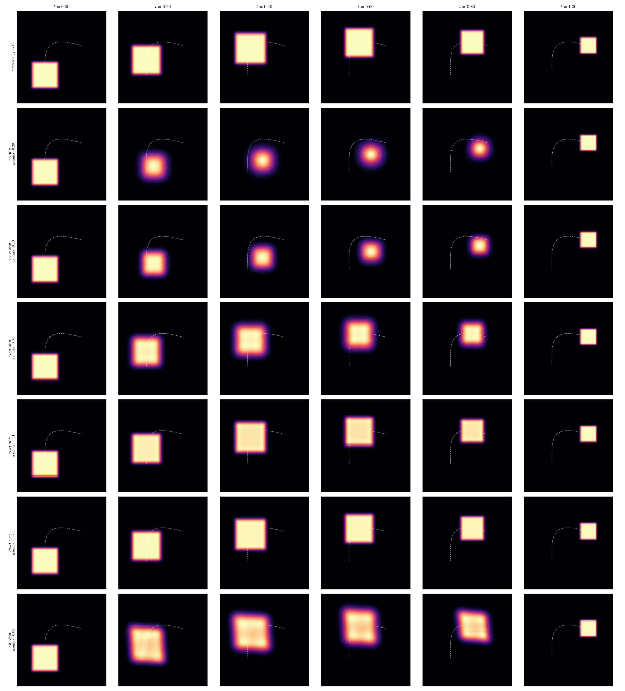

# Interpolation of squares

Stochastic interpolation between two square-shaped densities $\rho_0$ and $\rho_1$
along a *prescribed curved path*, using a Schrödinger bridge with a
reference drift (`exact_drift.py`).

The method is based on the article "Generative Modeling via Kernelized Stochastic
Interpolants": https://arxiv.org/abs/2602.20070. The sections below first lay out
the general theory, then show how `exact_drift.py` specializes it to the two-squares
example and what it plots.

## 1. Background: Schrödinger bridges with a reference drift

### Adding a drift

Let's say the original controlled diffusion process follows

$$dX_{t} = b_{t}(X_{t})dt + \sqrt{2\gamma}dW_{t}$$

We assumed that the reference process does not have a drift term in the process, so we add one

$$dX_{t} = \beta_{t}(X_{t})dt + \sqrt{2\gamma}dW_{t}$$

The energy functional becomes:

$$\mathcal{J}(\rho, b) = \int_0^1 \int_{\mathbb{R}^d} \frac{1}{2} |b_t(x)- \beta_t(x)|^2 \rho_t(x) \, dx \, dt$$

The Euler-Lagrange system with $b_t(x) = \beta_t(x) + \nabla \phi$ becomes

$$\begin{cases}
\partial_t \phi_t + \frac{1}{2} |\nabla \phi_t|^2 + \beta_{t}(x) \cdot \nabla \phi + \gamma \Delta \phi_t = 0 \\
\partial_t \rho_t + \nabla \cdot [\rho_t (\beta_{t}(x)+\nabla \phi_t)] = \gamma \Delta \rho_t \\
\rho_0 = \mu, \quad \rho_1 = \nu
\end{cases}$$

### Hopf-Cole transformation

Backward process:

$$\partial_t \eta_t^* +\beta \cdot \nabla \eta_t^*  + \gamma \Delta \eta_t^* = 0$$

Forward process:

$$\partial_t \eta_t +  \nabla \cdot(\beta \eta_t) - \gamma \Delta \eta_t = 0$$

Becoming transport–diffusion equations with the same advecting field $\beta$. We can set a divergence free field $\beta$ to have a symmetric field.

### IPFP iterations

The IPFP iterations are replaced by

$$g^{(k+1)}(x) = \log \nu(x) - \log \left( \mathcal{Q}_1 \left( e^{f^{(k)}} \right)(x) \right)$$

$$f^{(k+1)}(x) = \log \mu(x) - \log \left( \mathcal{Q}_1 \left( e^{g^{(k+1)}} \right)(x) \right)$$

with $\mathcal{Q}$ solving the solver for the forward and backward processes.
If we add advection in the process and minimize the diffusion part (even kill it ?), the given process becomes less diffusive.

### Recovering the drift $\beta_t(x)$

Once the bridge equations above are set, $\beta_t$ itself still needs to be estimated
from the data. Two options:

#### Weak formulation (used in this code)

The forward equation is $\partial_t \rho_t + \nabla \cdot (\rho_t \beta_t) = \gamma \Delta \rho_t$, so for any test functions $\varphi$

$$\frac{d}{dt}\mathbb{E}_{\rho_t}[\varphi] = \mathbb{E}_{\rho_t}[\beta_t \cdot \nabla\varphi] + \gamma\,\mathbb{E}_{\rho_t}[\Delta \varphi]$$

This leads to the weak formulation:

$$K_t\eta_t = \dot m_t - \gamma \ell_t$$

where:

$$(\kappa_t)_{ij} = \mathbb{E}_{\rho_t}[\nabla\varphi_i\cdot\nabla\varphi_j], \quad (m_t)_i = \mathbb{E}_{\rho_t}[\varphi_i], \quad (\ell_t)_i = \mathbb{E}_{\rho_t}[\Delta\varphi_i]$$

**Practical recipe**

1. At each snapshot time $t_k$, from N samples: assemble $\hat{K}_{tk}, \hat{m}_{t_k}, \hat{\ell}_{t_k}$ (use Hutchinson for Laplacian if needed)
2. Smooth $t_k \to \hat{m}_{t_k}$ (cubic spline / local polynomial) and differentiate to get $\dot{m}_{t_k}$
3. Solve $(\hat{K}_{t_k}+\lambda I)\eta_{t_k} = \dot{m}_{t_k}-\gamma\hat{\ell}_{t_k}$ (ridge regularization essential)
4. Interpolate $\eta_t$ in $t$, set $\beta_t = \nabla\varphi^\top\eta_t$, feed into drifted IPFP

## 2. This example: two squares along a curved path

`exact_drift.py` picks $\beta_t$ analytically instead of estimating it, so it can be
used as a ground truth for the weak-form recovery above:

- **Prescribed path.** The square is carried by a time-dependent affine map $\Phi_t(y) = \lambda(t) y + b(t)$: a sine-arc translation plus a breathing size, pinned so $\Phi_0 = \mathrm{id}$ and $\Phi_1$ sends $\mu$ to $\nu$.
- **Exact, curl-free drift.** Being affine in space, its velocity $\beta_t(x) = \frac{\lambda'(t)}{\lambda(t)}(x - b_t) + b'_t$ is the gradient of a quadratic.
- **Comparison.** Runs with no drift, a constant drift, and the exact drift (at decreasing $\gamma$) are compared against the noiseless reference path via the L1 distance and a debiased entropic Wasserstein-2 distance. As $\gamma \to 0$, only the exact-drift runs converge to the curved reference; the driftless bridge instead converges to the straight-line displacement interpolation.

## Figure



Each row is one configuration; each column a time `t`. Top row: the
noiseless reference path (curved trajectory, breathing size). Below: bridges
with no drift, a constant drift, and the exact drift at decreasing diffusion coefficient `gamma`.

## Run

```bash
python exact_drift.py
```

Figures are written to `outputs/` (`rho2d.png`, `slices.png`, `wasserstein.png`).